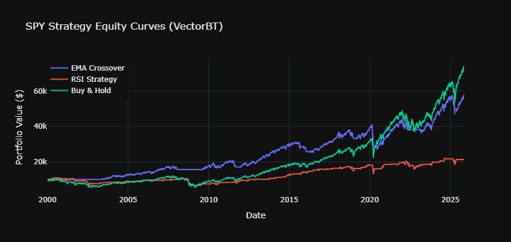
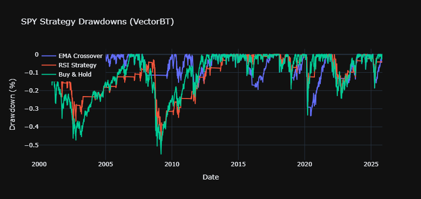
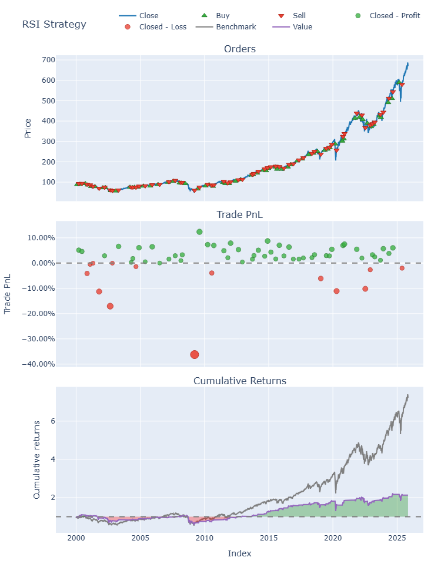

# 🏰 Fortress VectorBT & Plotly Dashboard

**Algorithmic Trading Backtester & Visualizer**
*Compare EMA Crossover, RSI, and Buy-and-Hold strategies using VectorBT and interactive Plotly dashboards.*

---

## 📘 Overview

This project demonstrates a complete **systematic trading analysis pipeline** built with **VectorBT** and **Plotly**.
It downloads financial data from Yahoo Finance, executes multiple backtests (EMA crossover, RSI, and benchmark),
and visualizes results through **interactive equity and drawdown charts**.

---

## ⚙️ Features

✅ Compare multiple trading strategies side by side
✅ Interactive equity & drawdown visualization with Plotly
✅ Clean performance summary (Sharpe, Sortino, Calmar, Drawdown, etc.)
✅ Optional CSV export for further analysis
✅ Modular, extendable design for adding new strategies

---

## 🧠 Tech Stack

**Core:** Python (Pandas, NumPy, VectorBT)
**Visualization:** Plotly, Matplotlib
**Data:** Yahoo Finance (yfinance)
**Indicators:** pandas-ta
**Focus Areas:** Systematic Trading · Backtesting · Quantitative Research

---
## 🖼️ Sample Result
Equity Curves:





Drawdowns:





EMA Crossover:


RSI Strategy:




---
## 📈 Example CSV Output

| Strategy      | Total Return | Max Drawdown | Sharpe | Sortino | Calmar |
| ------------- | ------------ | ------------ | ------ | ------- | ------ |
| EMA Crossover | XX%          | XX%          | X.XX   | X.XX    | X.XX   |
| RSI Strategy  | XX%          | XX%          | X.XX   | X.XX    | X.XX   |
| Buy & Hold    | XX%          | XX%          | X.XX   | X.XX    | X.XX   |


---

## 🚀 Getting Started

### 1️⃣ Install dependencies

```bash
pip install vectorbt plotly pandas yfinance pandas-ta
```

### 2️⃣ Run the script

```bash
python fortress_vectorbt_plotly.py
```

### 3️⃣ View results

* Interactive charts open automatically
* Summary CSV is saved as `strategy_summary.csv`


## 🏁 Author

**Fikri Direnc Aktas** — Quant Developer | Systematic Trader
📧 [Direncak2@gmail.com] | 🌐 [[LinkedIn Profile](https://www.linkedin.com/in/direncaktas/)] | 


